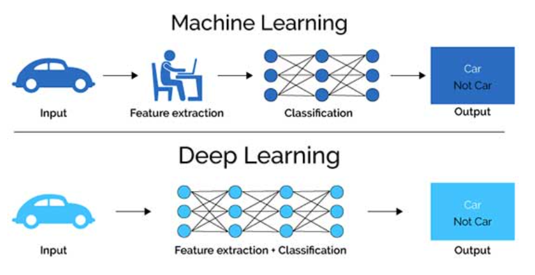
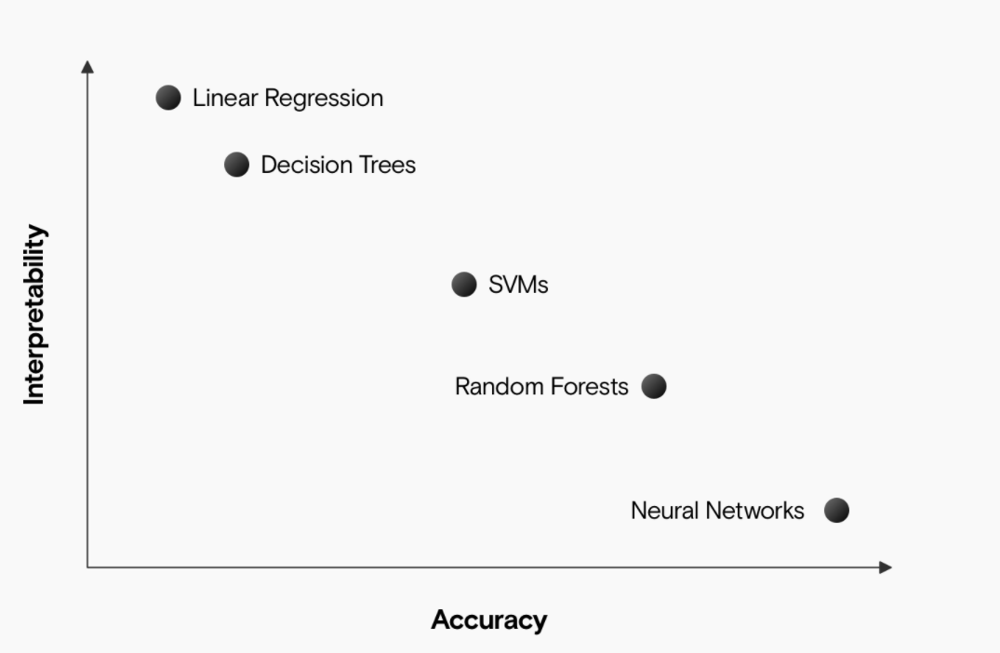

# 我眼中的机器学习

​                                                                                **1951095    梁伊雯**

[TOC]

## 1  机器学习的发展过程

机器学习是人工智能研究发展到一定阶段的必然产物。机器学习的发展也与人工智能的发展息息相关。从下面这张人工智能的发展历程图中，我们可以看到机器学习出现在大众视野中的时间大概在1980年代中叶的人工智能第二次发展热潮中。但这并不意味着机器学习是在那个时候才开始出现，在周志华《机器学习》[1] 一书中提到，图灵在1950年的文章中就提到了机器学习，只不过当时的人工智能还处于“推理期”。在1950年代至1970年代，人工智能还处于“**推理期**”和“**知识期**”，机器学习并没有得到人们的重视。而当人工智能到达“**学习期**”，也就是二十世纪八十年代后，机器学习才开始蓬勃发展。

按时间发展分析，我们可以将机器学习的发展划分为以下5个阶段：

- 第一阶段（20世纪50年代中期到60年代中期）：热烈时期

在这个时期，所研究的是“没有知识”的学习，即“无知”学习；其研究目标是各类自组织系统和自适应系统；其主要研究方法是不断修改系统的控制参数以改进系统的执行能力，不涉及与具体任务有关的知识。指导本阶段研究的理论基础是早在20世纪40年代就开始研究的神经网络模型，也就是基于神经网络的“**连接主义**”。

- 第二阶段（20世纪60年代中期至70年代中期）：冷静时期

主要是模拟人类的概念学习过程，并采用逻辑结构或者图结构作为机器内部描述。机器能够采用符号来描述概念（符号概念获取），并提出关于学习概念的各种假设，这就是基于逻辑表示的“**符号主义**”。

- 第三阶段（20世纪70年代中期至80年代中期）：复兴时期

在这个时期，人们从学习单个概念扩展到学习多个概念，探索不同的学习策略和各种学习方法。后来的“统计学习”理论的成果是在这个阶段取得的。机器的学习过程一般都建立在大规模的知识库上，实现知识强化学习。本阶段开始把学习系统与各种应用结合起来，并取得很大的成功，促进了机器学习的发展。1980年，在美国卡内基梅隆大学召开了第一届机器学习国际研讨会，标志着机器学习研究已在全世界兴起。

- 第四阶段（20世纪90年初到21世纪初）：现代机器学习成型时期

一方面，由于神经网络研究的重新兴起，对连接机制学习方法的研究方兴未艾，机器学习的研究已在全世界范围内出现新的高潮，对机器学习的基本理论和综合系统的研究得到加强和发展。另一方面，实验研究和应用研究得到前所未有的重视。人工智能技术和计算机技术快速发展，为机器学习提供了新的更强有力的研究手段和环境。

90年代中期前，主流技术为“**基于神经网络的连接主义学习**”。这与第一阶段的“连接主义”不同，那个时候的更偏向于符号化建模，能产生明显的概念，而这一主义产生的是“黑箱”模型。虽然这种连接主义也有明显弱点，但是由于有BP这样的有效算法，也能使其在一些现实问题上发挥作用。

在90年代中期，“**统计学习**”登场了，这时它逐渐成为了机器学习的主流，代表技术为支持向量机和核方法。统计学习与上面的连接主义学习有密切的关系。在连接主义学习的技术局限性凸显之后，人们才逐步转向了以统计学习理论为直接支撑的统计学习技术。

- 第五阶段（21世纪初至今）：蓬勃发展时期

随着Intel x86处理器和内存条的出现，连接主义学习卷土重来，这就是近几年火热的“**深度学习**”。它的兴起原因主要有两个，一是深度学习能处理大批量的样本数据；二是机器计算能力强，模型复杂度高，只需要调节参数就能获得好的性能。

## 2  机器学习方法及应用现状

一般来说，我们会按照训练样本提供的信息以及反馈方式的不同，将机器学习算法分为监督学习、无监督学习、半监督学习和强化学习。根据下图，我们可以根据目标变量的情况来选择采用的机器学习方法。

### 2.1  监督学习

监督学习是从输入的训练资料中学到或建立一个模式（函数），并提供预测量（目标变量）的真实值。训练资料是由输入物件（通常是向量）和预期输出所组成。我们可以比较模型预测值和对应的真实值之间的差别获得反馈，并依据这些反馈不断地调整模型。

根据标签类型的不同，又可以将其分为分类问题和回归问题两类。

- **分类**

**概念**：分类问题的目标是通过输入变量预测出这一样本所属的类别，而输入的数据通常是**离散**的量。

**应用**：例如对于植物品种、客户年龄和偏好的预测问题、垃圾邮件分类问题都可以被归结为分类问题。

**模型（算法）**：这一领域中使用最多的模型便是支持向量机，用于生成线性分类的决策边界。随着深度学习的发展，很多基于图像信号的分类问题越来越多的使用卷积神经网络来完成。

- **回归**

**概念**：回归主要用于预测某一变量的实数取值，输入值通常为**连续**量，其输出的不是分类结果而是一个实际的值。

**应用**：市场价格预测、降水量预测、房屋价格预测等。

**模型（算法）**：常用线性回归、多项式回归以及核方法等来构建回归模型。

### 2.2  无监督学习

数据中不含预测量的真实值，学习是在无监督信息的条件下进行的。也就是说，如果输入的数据是**没有标签**的，就是无监督学习。无监督学习也可以分为两类：聚类和降维。

- **聚类**

**概念**：将数据按列划分，将相似的样本聚到同类，即对数据进行聚类。

**应用**：商务上，帮助市场分析人员从客户基本资料库中发现不同的客户群，并用购买模式来刻画不同客户群的特征；生物学上，用于推导植物和动物的分类，对基因进行分类，获得对种群固有结构的认识；地理信息方面，在地球观测数据库中相似区域的确定、汽车保险单持有者的分组，及根据房子的类型、价值和地理位置对一个城市中房屋的分组上可以发挥作用。

**模型（算法）**：K-means、阶层式分群

- **降维**

**概念**：将数据按行划分，把高维空间的向量转化到低维空间的向量，即对数据进行降维。

**应用**：数据压缩、数据可视化

**模型**：主成分分析（PCA）

### 2.3  半监督学习

**概念**：半监督学习是有监督和无监督学习的结合。该技术利用标记和未标记的数据进行训练，通常是少量标记数据和大量未标记数据。使用半监督学习可以解决两个主要问题：转换学习和归纳学习。在转换学习的情况下，目标是标记给定的未标记数据。在归纳学习的情况下，目标是找到将输入映射到输出的函数。

**应用**：语音识别音频标记、自然语言处理、蛋白质结构预测

**模型（算法）**：自训练、生成式模型、基于图的半监督算法、基于分歧的半监督算法

### 2.4  强化学习

**概念**：强化学习是机器学习中的一个领域，强调如何基于环境而行动，以取得最大化的预期利益。也就是说，刚开始计算机在一个未知的环境中是什么也不知道的，但它能够通过和环境打交道来适应这个环境，学习到做什么动作才是最好的。

**应用：**深度强化学习在自动驾驶领域中的应用、化学分子逆合成和全新药物设计、游戏和围棋领域

**模型（算法）**：深度Q网络 (Deep Q-Network,DQN)、SARSA

> **思考**: 如何区分监督学习、无监督学习、半监督学习和强化学习？它们之间的关系又是怎么样的？

在这里，我想假设一个简单的情境来区分这四种方法：假设我们正在准备高考，高考的题目在上考场前我们未必做过，但在高中三年我们做过很多很多题目，懂解题方法，因此考场上面对陌生问题也可以算出答案。我们需要用一些已经做过的题（训练数据），形成解题方法（模型），来应对未知的题目（预测未知数据）。

**有监督学习**就是平时做的题目都有答案，但到高考做题时没有答案，我们需要通过相似题目的答案，形成解题方法求解高考题。

**无监督学习**就是平时做的题目全都没有答案，根据那些题目各自之间的相似关系分类讨论，从而生成一套自创的解题方案，最后高考时结果肯定不如有监督学习的好。

**半监督学习**就是做的题少部分有答案，大多数是没有答案的，那么需要做的就是根据现有数据尽可能求解那些没有答案的题，然后再将所有题集合，形成解题方法。

**强化学习**就是刚开始刷模拟题的时候什么答案也没有，但是通过不断地犯错和积累，阅卷老师给出的试卷分数可以反映解题的表现。只需要记住那些高分, 低分对应的行为, 下次用同样的行为拿高分, 并避免低分的行为。

这几种方法都属于机器学习的范畴，都是从样本中学习一般函数的统计过程。

## 3  关于机器学习的思考

### 3.1  机器学习能摆脱独立同分布的假设吗？

**（1）独立同分布的概念**

**独立同分布**(idependently and identically distributed, IID)：**独立**是指每次抽样之间是没有关系的，不会相互影响。**同分布**是指每次抽样，样本都服从同样的一个分布。可以用抛骰子的例子来解释这个概念：每次抛骰子，得到的点数是不会相互影响的，这是“独立性”；得到任意点数的概率都是六分之一，这是“同分布”。

**（2）假设独立同分布的原因**

机器学习假设独立同分布是为了使得训练的样本点有较好的总体代表性，并且简化计算。假设样本是独立同分布的，可以大大减小训练样本中个例的情形，使得训练出来的模型可以合理用于测试集。同时，它也可以简化优化问题中似然函数的计算。由于独立性的假设，似然函数可以写成这样：
$$
l(\theta)=P(x 1, x 2, x 3, \ldots, x(n) \mid \theta)=P(x 1 \mid \theta) * P(x 2 \mid \theta) * \ldots * P(x(n) \mid \theta)
$$
为了最大化观察到的事件的概率，取对数函数并最大化参数$\theta$ :
$$
\operatorname{argmax} \log (l(\theta))=\log \prod_{1}^{n} P(x(i) \mid \theta)=\log P(x(1) \mid \theta)+\log P(x(2) \mid \theta)+\ldots\\+\log P(x(n) \mid \theta)
$$
计算机计算多次加法效率很高，但计算乘法效率不高。这种简化使计算的效率得到了提高。

**（3）非独立同分布（Non-IID）的机器学习**

现实中的数据实际上大多是遵循非独立、同分布的。虽然大多数的机器学习遵循的都是独立同分布的假设，但近年来也有一些关于非独立同分布的机器学习的研究，所以说机器学习是可以脱离独立同分布的假设的，只是目前正处于研究阶段，且这种研究大多是与联邦学习相关的。

**联邦学习**是指多个客户（如移动设备、机构、组织等）在一个或多个中央服务器协作下协同进行去中心化机器学习的设置。也就是可以让不同地区的用户的数据只在相应地区进行使用和训练，模型之间产生通信，不外泄数据，从而保护了用户的隐私。数据的训练方法通常采用批量同步并行（ bulk synchronous parallel，BSP）的方法，需要大量的通信。

一般来说，有三个主要原因会导致机器学习违反独立和相同分布数据的假设：

1. 一个数据点的绘制会影响后续绘制的结果（相互依赖性）
2. 分布在某一点发生改变（不平稳性）
3. 数据不是通过同一个分布生成的（对抗性）

通常在视觉识别和计算生物学领域有数据相互依赖的情况，例如在视觉识别任务中，对象类别通常与视觉相关或按层次组织，而计算生物学中的任务通常以不同但相关的生物体和表型为特征。

Li等人在FedProx算法的局部目标函数中添加惩罚项，提出了FL的一种变体。他们进一步表明，他们的算法在从Non-IID数据学习时获得了更高的精度[2]。Kevin Hsieh等人提出了SkewScout模型[3]，它能够定期将本地模型发送到远程数据分区，并比较本地和远程分区之间的模型性能（例如验证精度等）。同时，根据Wu, Y .等人提出的Group normalization[4] 方法，SkewScout可以避免BSP下批量标准化的偏差导致的精度损失，通过控制分散学习算法的执行方式来调整数据分区之间的通信量，例如控制阈值来决定哪些参数是值得用于通信的。SKewscout是一种系统级的方法，它可以调整数据分区之间的通信频率，以反映数据中的偏斜，从而在保持模型准确性的同时最大限度地节省通信。

**（4）我的思考**

通过阅读几篇论文，我发现其实解决联邦学习中Non-IID问题主要考虑的因素是如何平衡不同分布所产生的模型之间的关系。有的是动态调整这些模型之间的权值 ；有的是通过每个模型相平均，传回中央服务器，再由中央服务器进行处理；有的是没有中央服务器，而是只和邻居交互[5]；而无论如何他们总缺少不了通信，同时还要平衡通信频率与精度损失之间的关系。而且，一般来说Non-IID会降低模型的精度和准确度。

### 3.2  深度学习

**（1）深度学习的概念**

深度学习是机器学习的一个分支领域，它是从数据中学习表示的一种新方法，强调从连续的层中进行学习，这些层对应于越来越有意义的表示。“深度学习”中的**“深度”**指的并不是利用这种方法所获取的更深层次的理解，而是指一系列**连续的表示层**。伴随着GPU的快速发展、数据集的增大以及算法上的改进，深度学习近年来得到了快速的发展，它也是近年来一个十分热点的发展方向。

**（2）深度学习与机器学习的区别**

首先用一句话来概括一下：深度学习是机器学习的一个专门子集，而机器学习又是人工智能的一个子集。换句话说，深度学习就是机器学习。

然后，通过上面这张图，我们能更直观地感受到机器学习和深度学习之间的差别。首先，对于机器学习而言，它需要一些结构化的数据来表示物体的特征，这一步骤对应于上图中的Feature extraction。例如，让手机根据手机相册中的内容自动整理图片。我们可以帮助手机识别各个图片，例如动物和风景，我们需要给这些的图片加上标签，以确定它们的特征，用这些数据来训练机器学习算法进行分类。而深度学习主要的区别在于，它不一定需要结构化/标记的图像数据来将对象分类为几个类别。意思就是，我们可以认为我们的手机有“人脑”的功能，可以通过不同层次的神经网络处理数据，然后找到合适的标识符对所需的对象进行分类。通过这个例子以及上面的这幅图片，我们可以更好地了解机器学习和深度学习之间的主要区别。

除此之外，机器学习和深度学习还有以下的这些区别：

- **硬件**：深度学习一般需要用强大的硬件（GPU）来对大数据集进行复杂计算，而机器学习可以在计算能力较低的机器上运行。
- **时间**：深度学习需要大量数据集，且参数较多，训练时长一般可以达到几小时到几周，而机器学习训练时间较短，可能只需要几秒钟到几个小时。
- **方法**：对一个复杂的问题来说，机器学习中的算法更适用于对分几个部分解决，然后将这几个部分组合起来得出结果或解决方案；而深度学习可以一举解决整个问题或场景。比如说目标检测问题，机器学习可能需要完成两个步骤：检测和识别。而深度学习仅需要一步就可以完成该操作。

**（3）深度学习的贡献**

随着深度学习的出现，我们可以让机器完成很多任务，比如计算机视觉、图像识别、自然语言处理、驾驶自动驾驶汽车、预测商业中某个事件的可能性等等。

在这里我们举几个行业中采用深度学习的例子：

- 自然语言处理：文本翻译可以在没有序列预处理的情况下进行，它允许算法学习文字与指向语言之间的关系。谷歌翻译利用的是大型递归神经网络的堆叠网络。
- 自动驾驶：借助深度学习，汽车研究人员现在能够自动检测交通信号灯、停车标志等物体。他们还使用它来检测有助于减少事故的行人。
- 医学研究：癌症研究人员正在使用深度学习来自动检测癌细胞。

深度学习主要具有下面的这5个优势，使得它在当今时代具有较大的影响和贡献：

- 能最大限度地利用非结构化数据
- 消除对特征工程的需求，节省时间
- 能够提高结果的质量
- 可以识别其他方式难以检测的缺陷，消除不必要的成本
- 消除了对数据标记的需要

**（4）深度学习与统计学习**

首先，我认为深度学习是**不能替代**统计学习的，但能够促进统计学习的发展。

统计数据可以处理大型集合，但会因高维而崩溃，因为对于低维度的处理方法不一定适用于高维度。深度学习研究需要分析极高维参数和输入空间的技术，研究深度学习需要以概率论和信息论作为基础。深度学习中的很多算法都与统计学息息相关，例如梯度下降之类的算法是最大似然估计的特例，dropout, dropconnect等都是采样的特例。统计学习是将深度学习过程数学形式化的一种方法，也就是说，深度学习在一定程度上是依赖于统计学习的一种思想。深度学习的快速发展对于统计学习也有一定的促进作用。

**（5）机器学习其它的发展方向**

近年来机器学习除了深度学习之外还有许多方向的研究热点，如迁移学习、对抗学习、元学习等。

**迁移学习**是把为其他任务（称其为源任务）训练好的模型迁移到新的学习任务（称其为目标任务）中，帮助新任务解决训练样本不足等技术挑战，利用任务之间的相关性来解决信息量较少的任务。

**对抗学习**是利用对抗性行为（比如产生对抗样本或者对抗模型）来加强模型的稳定性，提高数据生成的效果。近些年来，利用对抗学习思想进行无监督学习的生成对抗网络（GAN）被成功应用到图像、语音、文本等领域，成为了无监督学习的重要技术之一。

**元学习**是学会如何学习，重点是对学习本身的理解和适应，而不仅仅是完成某个特定的学习任务。也就是说，一个元学习器需要能够评估自己的学习方法，并根据特定的学习任务对自己的学习方法进行调整。

### 3.3  用于机器学习的数学方法

机器学习是由**统计学、微积分、线性代数**和**概率论**4部分驱动的，其中统计学是核心。而除了这四部分之外，近年来图机器学习也是一个研究热点，也就是说**图论**的知识也能在机器学习中发挥作用。下面我将简要介绍一下上面5个学科的知识在机器学习中的主要用途。

#### 3.3.1  微积分

我们主要用微积分的知识来学习和优化模型，微积分按通俗来说就是函数。在机器学习中，我们经常用到微积分中梯度和导数这两个概念，有时候我们还会在机器学习中再将其细分为微积分和最优化。机器学习的算法模型最终的求解往往都会涉及到优化问题，而这一切都需要微积分的理论和计算方法作为支撑。**微分基础、多元分析、优化基础、多元极值**这四部分是机器学习中求解模型的关键。

#### 3.3.2  线性代数

线性代数用来描述向量和矩阵的计算。在机器学习中，数据的向量和矩阵是十分常见的，例如每一个样本都能够被描述为一个向量，数据集可以被描述为一个矩阵。线性代数为描述数据以及我们需要在机器学习方法中执行的数据操作提供了有用的快捷方式，它可以帮助我们理解向量之间的相互影响，以及对向量、矩阵的操作。有一些常见的机器学习方法只能通过它们的线性代数描述来理解，如：

- 奇异值分解（SVD）
- 主成分分析
- 最小二乘法

除此之外，深度学习中的scalar、vector、matrix、tensor，系数的计算，tensor multiplication都与线性代数息息相关。所以说，线性代数是机器学习的核心基础。

#### 3.3.3  概率论

概率论，通俗来说就是能帮助我们预测某一件事情发生的可能性。概率论被广泛用于**建立预测函数，目标函数，以及对算法进行理论分析。** 如果将机器学习算法的输入、输出数据看作随机变量，就可以用概率论的观点对问题进行建模，这是一种常见的思路。

由于结果存在歧义，机器学习的模型基于估计和近似工作，这些估计和近似是通过概率完成的。当机器试图从数据（环境）中学习时，它必须对学习和决策的过程进行推理。如果不考虑所有可能的状态、场景及其可能性，这种推理是不可能的。我们需要应用概率论来测量和评估机器的能力。

机器学习中的一些算法是专门为利用概率工具和方法而设计的，例如使用贝叶斯定理构造的朴素贝叶斯。线性回归算法可以看作是最小化预测的 MSE 的概率模型。而逻辑回归算法可以被认为是一种概率模型，可以减少预测正类标签的负对数似然。

#### 3.3.4  统计学

统计学是数学的一个子领域，它指的是处理数据和使用数据回答问题的方法集合。虽然统计知识并非没有深奥的理论知识，但从统计与概率的关系中得出的一些重要、容易理解的定理，可以提供有价值的理论基础。在统计学中较重要的两个定理为**大数定律**和**中心极限定律**。第一个可以帮助我们理解为什么较大的样本往往更好，第二个定理为我们比较样本之间的期望值（例如：平均值）提供基础。

统计是数据科学中分析和处理数据的基础。机器学习算法中使用的许多性能指标，如准确率、精度、召回率、f 分数、均方根误差等，都使用统计数据作为基础。这些进一步有助于数据和性能算法的可视化表示，以便更好地理解。统计有助于识别特定的琐碎模式、数据中的异常值以及中值、均值、标准差等指标。

#### 3.3.5  图论

图近来正逐渐变成机器学习的一大核心领域，比如可以通过预测潜在的连接来理解社交网络的结构、检测欺诈、理解汽车租赁服务的消费者行为或进行实时推荐。图论中的Fiedler Vectors、Algebraic Connectivity、Spectral Graph Theory可以用于图像分区、聚类等机器学习应用上。下面这些例子都是应用到图论的实例：

- 在计算机视觉领域，图已被用于提取结构信息，这些信息随后可用于多种应用，例如对象识别和检测、图像分割等。
- 谱聚类是基于图论的聚类方法的一个例子。它利用相似矩阵的特征值来结合聚类和降维。
- 随机游走可用于预测和推荐社交网络中的链接或按相关性对网页进行排名。

### 3.4  如何衔接离散和连续的处理方法？

对于这个问题，我有两种理解：一是机器同时处理离散和连续的变量，如何只使用一种模式对这两种不同的变量分别处理？二是如何将这两种变量类型相互转换，从而来只用一种变量类型的处理方法进行处理？ 

对于**第一个问题**，机器学习处理连续数据时一般将其离散化。但近年来也有少数关于离散和连续变量共同处理的方法和研究。  2020年1月，谷歌母公司Alphabet旗下的DeepMind的研究人员提出了一种新技术——**连续离散混合学习**，它可以同时优化离散和连续的动作，以其固有的形式处理混合问题。这种技术能够用相同的算法可靠地处理离散和连续的操作，使用的主要是利用强化学习或奖励自主代理完成目标的训练技术，解决了连续和离散动作空间的控制问题，以及控制和自治切换的混合最优控制问题。这种方法可以让我们借鉴参考。或者说，我们可以做**变量间的特征融合**，采用神经网络进行求解。也就是将离散的变量用one-hot 编码，与连续特征进行拼接构成新的特征。然后使用全连接网络将离散变量的特征与连续变量的特征进行交叉。

对于**第二个问题**，在机器学习中我们一般将**连续数据离散化**。在特征工程中，特别是逻辑回归上，需要把一些连续特征进行离散化处理。离散化除了一些计算方面等等好处，还可以引入非线性特性，也可以很方便的做特征叉积。离散特征的增加和减少都很容易，易于模型的快速迭代。此外，噪声很大的环境中，离散化可以降低特征中包含的噪声，提升特征的表达能力。

连续数据离散化一般有3种方法：

1. 等宽法：将数据的值域分成具有相同宽度的区间。区间的个数根据数据特点或用户指定。缺点是对离群点比较敏感，不均匀地分布数据。
2. 等频法：将相同数量的记录放进每个区间。缺点是可能将相同的数据分到不同的区间。
3. 基于聚类分析法：将连续属性的值用聚类算法进行聚类，需要用户指定分组个数。将聚类得到的簇进行处理，合并到一个簇的连续属性值，并做统一标记。

那么对于我们平时学习的高数中来说，把连续问题离散化处理的方法主要是用级数和泰勒公式展开进行解决；或者利用海涅定理，将连续性的函数极限转化为离散性的数列极限。

### 3.5  大数据时代下的机器学习

#### 3.5.1  大数据时代机器学习研究方向

所以在小数据时代，人们的关注点在于如何提高机器学习模型的**泛化能力**，也就是如何尽可能还原出小数据集背后的超大真实模型。在大数据时代下，我们主要考虑的是**数据的分治**，因为我们拥有数据量极大的数据集，而且很复杂，我们需要提升计算能力，满足模型对这些数据的训练。在大数据时代下，机器学习的发展包括了两个研究方向：一是**学习机制**，重点在于模拟人类学习机制；二是**有效信息利用**，重点在于从大数据库中进行潜在知识的深入挖掘。

#### 3.5.2  大数据时代下机器学习的特点

大数据时代下的机器学习主要具有以下的这些特点：

（1）**数据集合大**。我们可以使用开发框架通过简单的、天然可靠和并行化的编程语言结构将新的编程语言框架，和我们使用的大数据存储及自动化的管理平台有效地组合在一起。

（2）**输入特征数据的高辨识维度。**基于机器学习的主要应用通常包括自然语言、图形、音视频等，现在应用程序中的这些数据特征实例，通常是由很多不同数量的数据特征实例来准确表示的，远远超过了目前我们常见的，能够轻松准确处理的数据特征的数量级别。我们可以使用一些在其他特征物理空间进行迭加的通用算法进行加速计算。

（3）**模型和学习算法的基本复杂性**。大数据下机器学习算法的一个共同技术特征，就是由于计算机的复杂性 , 单独一台大型机器的深度学习计算过程速度可能会非常慢。采用多个并行多内核节点或者并行多个内核节点处理，可有效提高在大规模数据中使用复杂的处理算法和复杂模型的综合计算运行速度。

（4）**预测应用级联**。级联应用需要具有高度复杂的功能联合进入输出计算空间，并行化在这种复杂情形下，可以大大提高理论推理的准确速度。很多用于现实生活中的技术问题，如图像物体运动追踪、语音图像识别以及各种机器翻译都可以要求用户执行一系列的互相之间依赖的数据预测，形成了多个预测器的级联。

#### 3.5.3  大数据时代下机器学习数据处理常用算法

大数据时代下机器学习常用的3种大数据处理算法分别是：数据并行算法、聚类算法和分治算法。

- 数据并行算法

在传统的机器学习算法中，并未实现并行化数据处理，单独数据处理难以自主实现大规模数据处理。为了满足大数据处理的需求，开展并行化运转，我们可以使用数据并行算法将大数据行“碎片化”处理，也就是将其拆分为可交由机器独立处理的模块，然后再综合汇总，实现大数据整体掌握。以图像处理平台为例，主要算法为并行算法，将各数据处理压力不断降低，提高数据运算能力。并行算法可以与分治算法及聚类算法等结合起来，实现三类算法的有效融合，可提升数据处理速度，也可于一定程度上保障机器学习精准性。

- 聚类算法

数据处理、数据挖掘中最为常用的一类算法便是聚类算法。聚类算法首先将数据结合不同类型予以划分，将大型数据划分到多项子数据节点中。其次，针对所划分完成的数据节点开展针对性处理，可以提升数据处理效率。此算法在机器学习中实际应用途径可分为三类：一为借助非迭代化数据扩展方式，即通过模糊集理论，针对数据开展FCM均值聚类分析，将数据予以精准分离；二为持续扩充子集合方式，于空间层面提升数据集合精准性；三为抽样均值算法，有效提升数据处理效率。

- 分治算法

分治算法于大数据处理领域而言，具备良好优势，可被引用至并行运算、分布式计算中。将大数据作为对象开展机器学习，因样本的数据差异将会对数据处理质量造成一定影响，除了会增加数据运算量外，也会对机器学习效率等形成制约。我们借助分治算法，可对原始样本开展预处理，挑除冗余及无效数据，提升原始样本数据集合质量。在这种处理手段下，可明确机器学习目标并降低学习难度，辅助机器生成准确判断。选取样本数据集合时，通常使用约减法及压缩近邻法等方式，数据处理原理即为寻找同大数据所相应的最小数据集合，借助一系列测试对子集予以不断优化、完善。此时，计算机所找寻数据样本可表示全部样本且具备高科学性，以此为开展数据判断、决策提供参考。

### 3.6  可解释性

在学习中我常常听到“可解释性”这个词，但我并不了解什么叫可解释的机器学习。通过搜索资料，我了解到可解释性的定义是“Interpretation is the process of giving explanations to Human”（ICML），也就是我们人类能够理解决策原因的程度。机器学习模型的可解释性越高，人们就越容易理解为什么做出某些决定或预测。如果我们能说出一个模型是如何做出决定的，那么这个模型是可以解释的。如果一个模型的决策比其他模型的决策更易于人类理解，则该模型比另一个模型具有更好的可解释性。

为什么说深度模型的可解释性低呢？因为深度模型就像一个“黑箱”，我们很难去说明一条样本数据灌进一个神经网络出来这样一个预测结果的原因，这造成的直接后果就是很多时候我们不清楚如何针对一个网络做优化。所以深度学习是需要可解释性的。

使用可解释的模型，我们可以在机器学习中实现以下的目标：

- **公平**：如果我们确保我们的预测是公正的，我们就可以防止对代表性不足的群体的歧视。 
- **鲁棒性**：我们需要确信模型在每个设置中都能正常工作，并且输入的微小变化不会导致输出发生大的或意外的变化。
- **隐私**：如果我们了解模型使用的信息，我们可以阻止它访问敏感信息。

那是不是所有问题都选择具有可解释性的模型才会更好呢？并不是这样的，回归和决策树等更简单的算法通常比神经网络等复杂模型更容易解释，但它们在大数据集上的准确性却没有神经网络高，所以有时候我们需要在可解释性和准确性之间进行权衡。

### 3.7  我对NLP领域机器学习的看法

在大二下学期时，我参加了一个基于机器学习的自然语言分析的比赛，我们主要对分类算法中的KNN进行了改进，以此为主要模型对企业的产品报错信息进行分类。其实我一直认为，在NLP领域，将文字转换为特征向量是最重要的一个步骤。我们用在于处理上的时间大约占了70%，而用在模型拟合与优化上的时间只有30%。而且，在转换成特征向量的过程中，我们还必须去除一些无用的信息。那么这些无用的信息究竟是由人来判断还是由机器来判断呢？在比赛时我们是自己来判断的，我们通过查看大量的数据找出了其中的一些规律，根据某些具有标识性的文字将数据集分成了3大类，然后再分别进行处理。在这个基础上，我认为人来分类是比机器更准的。但是如果面对数据量十分庞大的数据集，仅仅依靠人的观测需要十分庞大的工作量。所以我想提出的第一个问题是，**在面对庞大的数据集时，机器是如何发现文字之间的规律的？如何去除无用的文字信息，找到关键的文字信息进行分类？**

对于这次比赛，我们并没有采用深度模型，而是只使用了简单的机器学习模型就能够获得一个良好的拟合效果。通过这次的比赛我也懂得了，并不是所有情况下都一定需要用到深度学习，而是应该依据**数据集的大小和复杂程度**来决定。对于能够较快找到规律的数据集，我们可以通过人工划分减少工作量，然后采用机器学习的方法处理。因为深度模型可解释性低，不利于后面的模型优化。那么在这里我也想提出第二个问题：**在NLP领域中，深度学习对于机器学习有何优势？为何深度学习采用的范围这么广？**

#### 3.7.1  文本特征提取方法

针对**问题一**，通过学习我了解到机器提取文本特征和过滤无用信息主要包括几种方法，分别是**过滤、融合、映射和聚类**。文本被视为N维空间中的一个点，点的每个维度的基准代表文本的一个数字化特征。文本特征通常使用关键字集，这意味着在一组预定义的关键字的基础上，我们可以通过一定的方法计算文本中单词的权重，然后形成一个数字向量，即文本的特征向量。

##### 3.7.1.1 过滤方式

这种方法特别适用于大规模的文本特征提取，文本特征提取的过滤方式主要有词频、信息增益、互信息法等。词频是指一个词在文本中出现的次数。通过词频进行特征选择是指删除频率小于某个阈值的词，以降低特征空间的维数。但是在信息检索的研究中，有的时候频率较低的词也可能具有更多的信息，所以单单使用词频是远远不够的。在比赛中我们使用的词频统计方法为TF-IDF方法，这种方法也是当今较为流行的词频统计方法之一。

##### 3.7.1.2 融合方式

融合需要整合特定的分类器，搜索需要在指数增长区间内进行。时间复杂度很高。因此，不适合用于大规模文本的特征提取。加权方法是一种特殊的融合方式。它为每个特征赋予一个在 (0, 1) 范围内的权重，以便在进行调整时进行训练。也就是说，可以根据向量到分类中心的距离为其进行加权（如加权KNN）。

##### 3.7.1.3 映射方法

这种方法通常用于LSI（潜在语义索引）和PCA。LSI[6]是ST Dumais等人提出的一种新的信息检索代数模型。它是一种用于知识获取和演示的计算理论或方法，使用统计计算方法分析大量文本集，从而提取单词之间的潜在语义结构，并利用这种潜在结构来表示单词和文本，从而通过简化文本向量来消除单词之间的相关性并降低维数。潜在语义分析的基本概念是将高维 VSM 中表示的文本映射到低维潜在语义空间。这种映射是通过项目或文档矩阵的 SVD（奇异值分解）来实现的。

##### 3.7.1.4 聚类方法

聚类主要考虑文本特征的基本可比性，以对文本特征进行聚类。然后利用每个类的中心来替换该类的特征。这种方法的优点是压缩比非常低，分类精度基本保持不变。它的缺点是时间复杂度极高。比较常用的方法是CHI（卡方）聚类方法，通过计算每个特征词对每个类别的贡献（计算每个特征词得到每个类别的CHI值），CHI聚类可以使共同的分类模型取代每个词对应的模式传统算法中的一维。

#### 3.7.2 NLP领域的深度学习

针对**第二个问题**，我想首先第一个原因应该是深度学习在NLP领域的表现要比机器学习好得多，不然是不会成为当前最流行的方法的。其次，由于深度学习中词嵌入方法的出现，我们能够更好地寻找词与词之间的关系。传统的NLP常使用one-hot encoding来固定表示词汇表中的单词。但这样会导致词汇的向量过于稀疏和庞大，还忽略了词与词之间的关系，这就让模型的学习变得更加困难。

 2013 年 **word2vec** 的诞生，词向量恰好与神经网络偏好的稠密的输入非常契合。采用这种技术，词向量能够将深度网络和人类文字很好地结合起来，是神经网络能够理解文字的关键一步。传统的语言模型很难做到长序列的记忆与处理，而 RNN 理论上可以实现无限长的记忆处理，所以后来在大多数 NLP 领域中，深度学习最终能占了上风。

第三个原因是深度学习自身所带来的优点，即不再需要手工筛选特征，一切变成了一个黑箱。门槛降低了，也就越来越多的人采用这种方法。

第四个原因是对于很多问题都能够套用End2End模型。End2End 模型免去了非常多的复杂操作与专业知识，并对拥有大量数据的企业是巨大优势，比如 google 的 NMT 模型，还有很多对话系统方面都用上了 End2End，只要用现有数据就能得到一个效果极佳的结果。

但是其实我们了解到的还只是NLP一些顶层的设计，也就是“篇章”级的应用，底下这些中文分词等都已经有很好的工具了，不用再从头到尾去开发。我们只要关心上层的应用，把底下的工具用好，让它产生需要的Feature，来做分类、主题模型、文章建模，这种比较高层次的应用。但是我希望通过《机器学习》这门课，了解更多的内部原理和数学知识。我希望我最终能成为一个“写包者”，而不是一个简简单单的“调包者”。

## 参考文献

[1] 周志华，机器学习，清华大学出版社，2016

[2]Tian Li, Anit Kumar Sahu, Manzil Zaheer, Maziar Sanjabi, Ameet Talwalkar, and Virginia Smith. Federated optimization in heterogeneous networks.arXiv preprint arXiv:1812.06127, 2018.

[3] Hsieh, Kevin, et al. "The non-iid data quagmire of decentralized machine learning." *International Conference on Machine Learning*. PMLR, 2020.

[4]Wu, Y . and He, K. Group normalization. In ECCV, 2018.

[5] Arya Ketabchi Haghighat, Varsha Ravichandra-Mouli, Pranamesh Chakraborty, Yasaman Esfandiari, Saeed Arabi, and Anuj Sharma. Applications of deep learning in intelligent transportation systems.Journal of Big Data Analytics in Transportation, 2(2):115–145, 2020.

[6] NE Evangelopoulos, Latent semantic analysis. Annual Review of Information Science and Technology 4(6), 683–692 (2013)