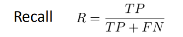

## 机器学习小测复习

1. 什么是机器学习

*a set of methods that can* *automatically detect* *patterns* *in data, and then use the uncovered* *patterns to* *predict future data**, or to perform other* *kinds of decision making* *under uncertainty*

2. 机器学习发展的时间线

- 1950-1970   推理期
- 1975-1980   知识期
- 1980-2010  学习期（符号主义学习、连接主义学习、统计学习、连接主义学习）

符号主义学习：决策树       连接主义学习：MLP 多层感知机      统计学习： SVM

连接主义学习： CNN  深度网络

3. 分类和回归的区别： 分类是离散的值，回归是连续值   他们都是监督学习

4. 解决过拟合的方法：

5. 划分训练集和测试集的方法：
   - **留出法**：划分为两个互斥集合。 注意要保持比例，分层采样（训练集和测试集中，各个类别的比例是要一样的）  一般划分比例为**2/3** - **4/5**
   - **交叉验证法**：用整个数据集的数据，如果是10折交叉，那么分成10份，9个训练，1个测试，会有10个结果。 注意：每个点会被使用相同的次数！
   - **自助法**：从D中可重复抽取m次，获得训练集D'。m趋于无穷的时候，没被抽到的（当测试集的）大概有0.368。这个方法在数据集小，难以划分的情况下有用。缺点就是抽出来的D'与原数据集不是同分布的。

6. 度量方法

| 名称                | 公式                                                         |
| ------------------- | ------------------------------------------------------------ |
| 均方误差            |                       |
| 错误率              |                       |
| 精确率              |                       |
| 查全率（Precision） |   TP：真正率  FP： 假正例  混淆矩阵竖着的一列 |
| 查准率（Recall）    |                       |
| F1 score            |                       |
| F_b score           |                       |

7. P-R曲线（还不是很了解，为什么两个率到达1的时候，另外一个是0？看个视频学学！）

8. ROC曲线绘制步骤：

- 采样，排序
- 设置分类阈值（也就是，一个一个把它们认为是正例子）
- 根据当前的判断更新坐标

9. 欠拟合和过拟合

记住这两张图，以及他们的方差、偏差的状态！  左边是欠拟合，右边是过拟合

10. 解决过拟合和欠拟合的方法：

    

11. 机器学习的典型过程
    - 定义具有未知参数的函数
    - 定义训练数据的loss
    - 优化

12. Loss类别： MAE(绝对值相减)   MSE（相减的平方值）  交叉熵

13. 梯度下降法：沿着梯度的反方向是下降最快的地方

高维中，梯度是每一个方向的（x,y,z）的偏导数

如果梯度是正数，那么增加w；反之减小w

梯度更新公式：
$$
w^{1} \leftarrow w^{0}-\left.\eta \frac{\partial L}{\partial w}\right|_{w=w^{0}}
$$

14. 学习率过大：跳过最小点    学习率过小：更新速度慢
15. adaptive的学习率：刚开始的学习率大一点，后面的学习率会越来越小

Adagrad:
$$
w^{t+1} \leftarrow w^{t}-\frac{\eta}{\sqrt{\sum_{i=0}^{t}\left(g^{i}\right)^{2}}} g^{t}
$$

16. 随机梯度下降：更快！   每次只看一个样本的loss
17. 特征如果不缩放的话，沿着梯度下降的方向，也要走很久到圆心。 
18. 特征标准化，就是让它的平均值为0，方差都为1
19. 梯度下降的优缺点：

20. 正则化

岭回归：L2范式，平方求和    **倾向于在相关特征之间均匀地分配权重**

Lasso 回归：L1范式，绝对值加和   L1解可能是稀疏的   **从相关的特征中选择一个，其余的特征权重衰减为零**（特征选择）

21. 熵的公式：   0~1之间的一个数字

$$
\operatorname{Entropy}(X)=\sum_{c}-p(X=c) \log _{2} p(X=c)
$$

22. 信息增益：划分前的熵减去划分后的熵，后面的熵需要加权！

$$
\operatorname{Gain}(D, a)=\operatorname{Ent}(D)-\sum_{v=1}^{V} \frac{\left|D^{v}\right|}{|D|} \operatorname{Ent}\left(D^{v}\right)
$$

23. 纯度越高，giny index越低！！

24. CART： Gini_index  
25. C4.5 增益ratio
26. ID3  信息增益

27. Sigmoid函数

$$
\sigma(z)=\frac{1}{1+e^{-z}}
$$

注意两个性质：

28. 交叉熵：

$$
\sum_{n}-\left[\hat{y}^{n} \ln f_{w, b}\left(x^{n}\right)+\left(1-\hat{y}^{n}\right) \ln \left(1-f_{w, b}\left(x^{n}\right)\right)\right]
$$

交叉熵最后化简出来的公式：
$$
\sum_{n}-\left(\hat{y}^{n}-f_{w, b}\left(x^{n}\right)\right) x_{i}^{n}
$$
梯度下降的更新公式：
$$
w_{i} \leftarrow w_{i}-\eta \sum_{n}-\left(\hat{y}^{n}-f_{w, b}\left(x^{n}\right)\right) x_{i}^{n}
$$

------

sept1: get p(yes)

